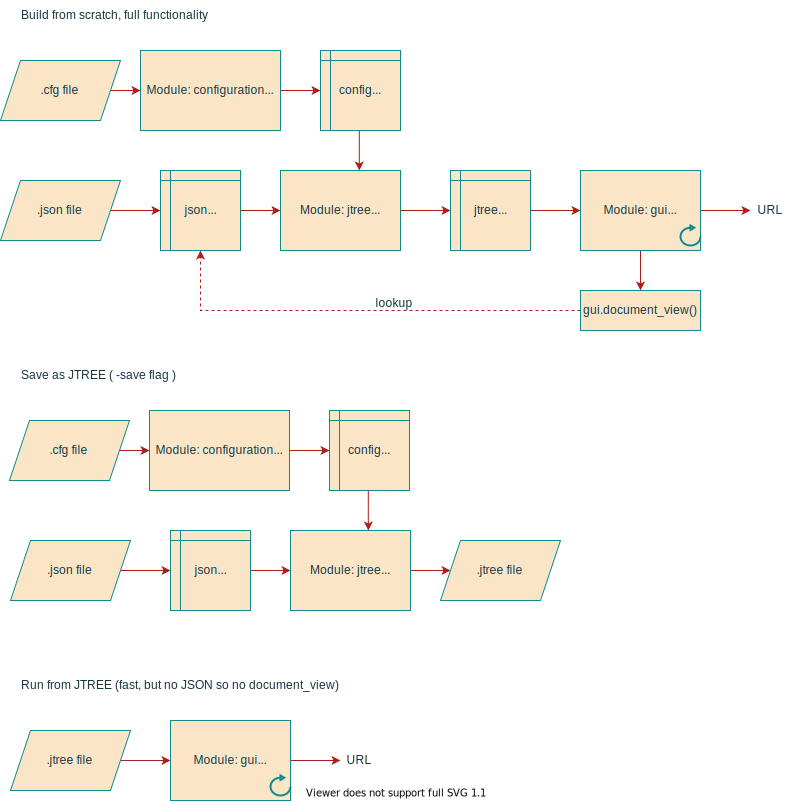

# JSON Explorer

## One tool to tool them all

JSON Explorer låter dig skriva en konfiguration, som organiserar en JSON-fil (vilken som helst) i nästlade grupperingar, och visar det som en trädvy. 
Det gör att man kan få god överblick över sin data, ur flera olika aspekter. 
Att användas för analys av innehåll och datakvalitet. 
Det grafiska gränssnittet är byggt med [PySimpleGUI](https://pysimplegui.readthedocs.io/).

## Demo

Börja med att köra en demo. Följande trädvyer finns i demon:
* JobSearch - Anställningstyp > Lönetyp
* JobSearch - Antal jobbpositioner
* JobSearch - Geografi
* JobSearch - Kompetenskrav
* JobSearch - Krav på arbetslivserfarenhet
* JobSearch - Språkkrav
* JobSearch - Yrkestaxonomi
* Jobtech Links: Annonser som saknas på AF
* Jobtech Links: Externa annonssajter
* SUSA-navet: Gymnasieutbildningar
* SUSA-navet: Högskola > Ämnen > Utbildning
* SUSA-navet: Myndighet > Skoltyp > Lärosäte
* SUSA-navet: Utbildningar med flera lärosäten
* SUSA-navet: Utbildningar som saknar beskrivning
* SUSA-navet: Vilka utbildningar finns? (CSN, avgift o.s.v.)

Baserat på tre olika JSON-filer:
* [JobSearch](https://jobsearch.api.jobtechdev.se/) är Platsbankens platsannonser ([pb.json](https://jobstream.api.jobtechdev.se/))
* [Jobtech Links](https://links.api.jobtechdev.se/) innehåller även andra sajters platsannonser ([links.json](https://data.jobtechdev.se/annonser/jobtechlinks/index.html))
* [SUSA-navet](https://susanavet2.skolverket.se/swagger-ui/) är en nationell databas för utbildningar ([susa.json](https://gitlab.com/arbetsformedlingen/education/education-scraping))

Alla JSON-filer har skapats med data aktuella i januari 2022.

## Demo i Windows

För Windows-användare finns en körbar **json_explorer.exe**, inklusive flera exempel på trädvyer/konfigurationer.   
Finns att ladda ner här: https://github.com/erik-gbg/json-explorer/releases/

## Demo i Python

Installera Python-paket med: `pip install -r requirements.txt`  
Krav: Python 3.8+  

Starta JSON Explorer utan argument: `python json_explorer.py`

Välj ett scenario från menyn, vänta på att JSON-filen laddats, sedan kan du bläddra runt och undersöka datat.

Det skapas ett menyval för varje .jtree-fil i underkatalogen `./jtrees` (kan skapas genom att köra med flaggan -saveall). Om denna katalog saknas, så skapas istället menyval för varje konfigurationsfil (.cfg) i katalogen `./resources`. 

## Konfiguration

Konfigurationsfilens (.cfg) syntax är enligt modulen [configparser](https://docs.python.org/3/library/configparser.html). 
Grupperingar, filter m.m. definieras med Python-uttryck som lambda-funktioner. 
Lambda-funktionerna identifierar fält i JSON-filen och processar dem.

## JTREE-formatet

JSON Explorer låter dig spara den byggda trädstrukturen, för snabbare laddning (angående framtida syften se Todo). 
Filformatet kallas .jtree.

## Köra från kommandoraden

Grundidén är att köra med följande två argument:

    python json_explorer.py <konfigurationsfil>.cfg <JSON-fil>.json

Konfigurationen appliceras på JSON-filen och skapar trädvyn som visas i GUI:et. Testa t.ex. att köra:

    python json_explorer.py ./resources/pb_geo.cfg ./resources/pb.json

## Om alla kommandoradsargument

Innan vi går in på själva kommandoradsargumenten, så ska man ha koll på att det finns två signifikanta underkataloger för datafiler:
* `./resources` innehåller .cfg och .json-filer
* `./jtrees` innehåller .jtree-filer (ingår inte i repot, måste skapas)

### Kommando-synopsis:

    usage: python json_explorer.py [[-build | -saveall | file.jtree | [-save] [file.cfg] [file.json]]

Inga argument:
* Demo-meny för alla vyer i `./jtrees`. Och om inte den finns: för alla i `./resources`

Utan filargument:  
* **-build** -> Demo-meny för alla .cfg-filer i `./resources`
* **-saveall** -> Bygg för alla .cfg-filer i `./resources` och spara som .jtree-filer i `./jtrees`

Med filargument:  
* **file.cfg file.json** -> Normalfallet. Konfiguration appliceras på json-filen, och GUI startas och visar trädvyn
* **file.cfg** -> Som ovan, men namnet på json-filen hämtas från konfigurationsfilen
* **file.json** -> Json-filen visas helt platt, utan konfiguration, i trädvyn.
* **-save** -> Om denna flagga läggs till, så kommer ovanstående körningar istället spara resultatet som jtree-filer
* **file.jtree** -> GUI startas och visar trädvyn för jtree-filen

## Flödesschema

## Todo

Det är inget stort steg att översätta jtree till html. 
På så sätt skulle man på ett lättviktigt sätt kunna göra dessa trädvyer tillgängliga för allmänheten, stand-alone.

Konfigurationssyntaxen kan göras enklare (människovänlig). Och ja, behöver dokumenteras ordentligt (även om det redan torde vara hyfsat självförklarande).

### Credits

Tree logo by Leo Reynolds  
https://www.flickr.com/photos/lwr/49983862402

